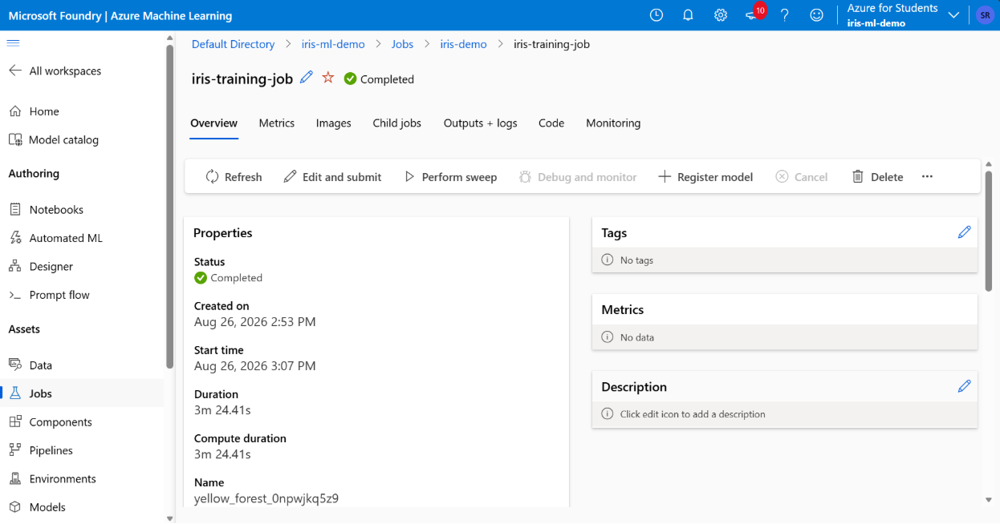
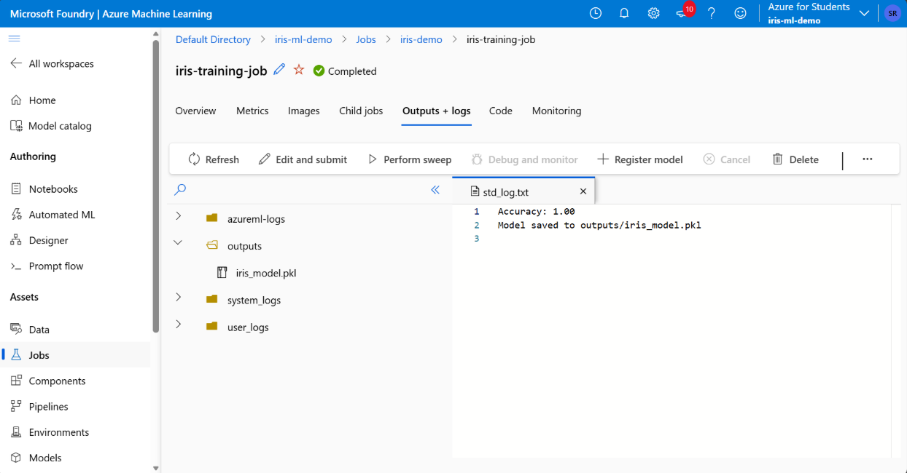
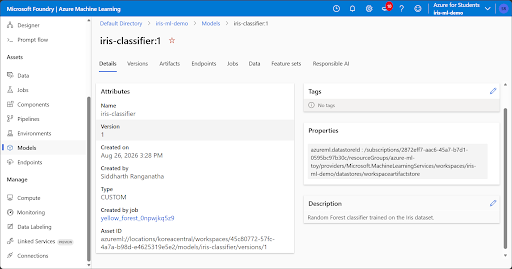
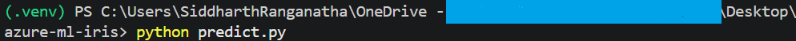
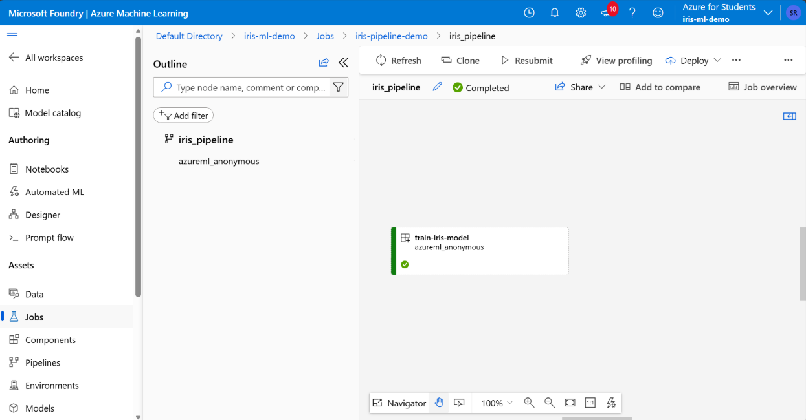
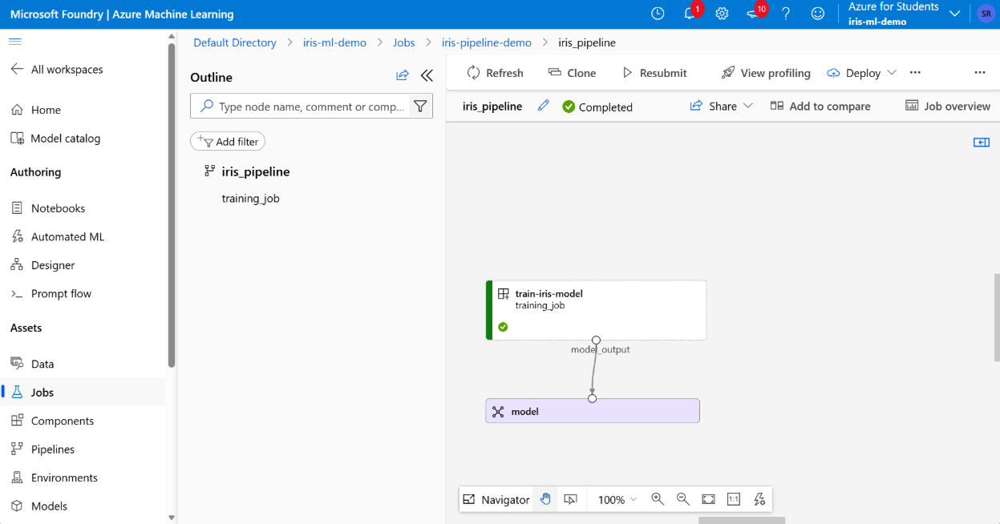

# Azure ML Iris Classification Pipeline

A small toy project built to understand the basics of **Microsoft Azure Machine Learning**.

The project trains a Random Forest model on the Iris dataset and demonstrates the flow from model training to artifacts, model registration, prediction, and pipelines.

## What does the model predict?

The model predicts the **species of an Iris flower** based on:

- Sepal length
- Sepal width
- Petal length
- Petal width

The three possible classes are:

- Iris Setosa
- Iris Versicolor
- Iris Virginica

This is a **classification** problem.

## Azure ML Workflow

```text
Iris Dataset
     ↓
Train Model
     ↓
Azure ML Job
     ↓
Model Artifact
     ↓
Model Registry
     ↓
Prediction
```

The training process was also packaged into an Azure ML Pipeline:

```text
Training Component
        ↓
   Pipeline Job
        ↓
   Model Output
```

## Project Structure

```text
azure-ml-iris-classification-pipeline/
│
├── screenshots/
│   ├── training-job.png
│   ├── job-outputs.png
│   ├── model-registry.png
│   ├── pipeline-graph.png
│   ├── pipeline-output.png
│   └── prediction.png
│
├── .amlignore
├── .gitignore
├── connect.py
├── job.py
├── pipeline.py
├── predict.py
├── train.py
└── README.md
```

## 1. Model Training

`train.py` loads the Iris dataset and trains a **Random Forest Classifier**.

The model achieved:

```text
Accuracy: 1.00
```

The trained model is saved as:

```text
outputs/iris_model.pkl
```

## 2. Azure ML Job

The training script was submitted to Azure ML as a Job and executed on an Azure ML Compute Cluster.



## 3. Job Artifact

The trained model was produced as a Job output/artifact.

```text
outputs/iris_model.pkl
```

The Job logs also show the model's accuracy.



## 4. Model Registry

The model artifact was registered in the Azure ML Model Registry as:

```text
iris-classifier
Version 1
```



## 5. Prediction

The trained model was loaded using `predict.py` and given new flower measurements:

```python
[5.1, 3.5, 1.4, 0.2]
```

The model predicted:

```text
Predicted class: 0
```

Class `0` corresponds to **Iris Setosa**.



## 6. Azure ML Pipeline

The training code was packaged as an Azure ML Component and executed as part of an Azure ML Pipeline.



The model output from the training component was exposed as a pipeline output.



## Key Azure ML Concepts Learned

- **Job** – runs ML code on Azure infrastructure
- **Artifact** – output produced by a Job
- **Model Registry** – stores and versions trained models
- **Component** – reusable ML step
- **Pipeline** – connects multiple ML steps into a workflow
- **Compute** – infrastructure used to run Jobs
- **Environment** – defines the Python packages and runtime required by the Job

## Tech Stack

- Python 3.12
- scikit-learn
- pandas
- joblib
- Azure Machine Learning
- Azure ML SDK v2
- Azure CLI

## Purpose

This project was created as a hands-on exercise to understand the basic Azure ML workflow before working on a more realistic machine learning project.

---

# 👨‍💻 Author

## Siddharth Ranganatha
